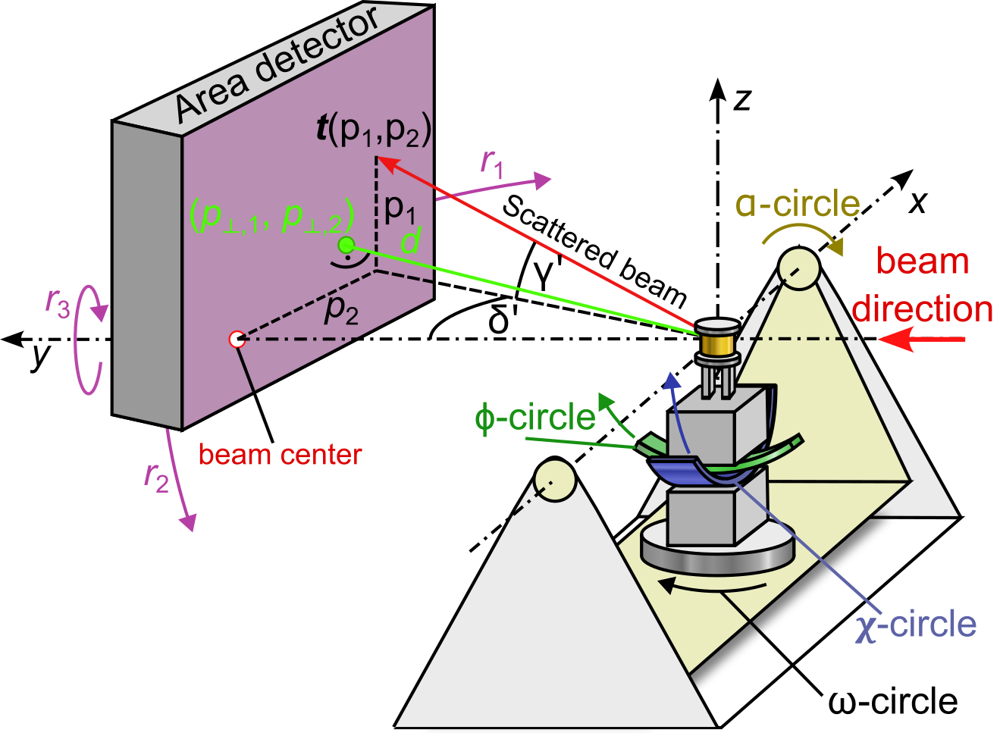

orGUI: : Orientation and Integration with 2D detectors
======================================================

.. |logo| image:: ./orgui/resources/icons/logo.svg
   :height: 320px
   
|logo|

orGUI is a software that can be used to determine the orientation of single crystal samples in X-ray diffraction experiments 
from the observation of few reflections on a large, statinary 2D detector. 
The settings of a 4-circle sample positioning stage as used for surface X-ray diffraction can be calculated. 

Its primary usecase is High Energy Surface X-ray Diffraction (`HESXRD <https://doi.org/10.1126/science.1246834>`_) or Transmission Surface Diffraction. 

Intensity integration is possible along arbitrary directions in reciprocal space (in reciprocal lattice coordinates (*h k l*)). Stationary and rocking scans can be integrated. 
In addition, the crystal orientation obtained by *orGUI* can be used for further processing with other software such as `binoculars <https://github.com/id03/binoculars>`_, which is described in `here <https://doi.org/10.1107/S1600576715009607>`_. 
Examples for the application of orGUI and binoculars for CTR data analysis is described in the Supporting Information `this <https://doi.org/10.1002/anie.202304293>`_ paper or the Methods section of `this <https://doi.org/10.1038/s41929-020-0497-y>`_ paper.

Installation
------------

To install orGUI (and all its dependencies), run:

.. code-block:: bash

    pip install orGUI[full]

To install orGUI with a minimal set of dependencies, run:

.. code-block:: bash

    pip install orGUI

Documentation
-------------

A detailed documentation is not yet available, but will be provided in a future release.

   
|diffractometer|

orGUI uses the diffractometer convention by Lohmeier & Vlieg 1993 (`https://doi.org/10.1107/S0021889893004868 <https://doi.org/10.1107/S0021889893004868>`_). However, the phi-circle rotates around the x-axis instead of the z-axis!. The azimuth angle in "machine parameters" rotates the whole diffractometer around the primary beam direction. Also theta = -omega. (Since at ID31 this rotation is right-handed).
xyz in lab frame is: y along beam direction, z along direction defined by azimuth (when azimuth = 90°, z points upwards), x perpendicular to both. 

Here is a simplistic description of the usual workflow for crystal truncation rod integration (a more complete manual will follow): 

For setting the orientation matrix, there are 2 methods available:

1. Expert mode: This is in the menu Reciprocal Space -> Edit orientation matrix. This is more intended to be used if symmetries can be directly observed at specific angle settings and applies more to Transmission Diffraction (e.g. if you see that two Bragg reflections have identical intensities, a reference position can be obtained from that). This is not really extremely useful for Grazing incidence geometry since you have to think about what you are doing.

2. Conventional setting of matrix using reference reflections (Busing & Levy): The images and the window "Reciprocal space navigation" is used for that. Double clicking at any position in the image will set a red reference reflection at this specific image. The position of the marker on the image defines the scattering angles and the image number gives the sample rotation angle (i.e. theta) of the reference reflection. You can drag+drop the marker around in the image and the image number can be changed with the two buttons in the top right corner of the "Reciprocal space navigation" window (one button selects the current image for the chosen refllection; with the other you can jump to the image which was previously selected for the reflection). Usually the HKL values are wrong when you add a reflection. This can be overridden in the table in the Reciprocal space navigation window. To calculate the matrix click "calculate U". This function also works with only one reference reflection by assuming that the L axis is pointing towards the z/azimuth-direction (Enable View->machine parameters to display a marker at the z-direction). For other geometries you need at least 2 reference reflections. So what I ususally do is to search for a nicely visible reflection close to L = 0 (Either a Bragg reflection or a CTR at L = 0 usually work fine.)

When the matrix is set correctly, the calculated CTR reflections (Enable View->CTR reflections) should match up with the ones in the data when you change the active image.
To integrate a stationary scan (i.e. for each image, find the intersection of the CTR with the image and integrate a ROI around it), use hklscan in the ROI integration tab on the left side. To visualize the ROI on the image, enable View-> show ROI. Lorentz correction is not yet automatically applied here! Setting a pixel mask works by using the mask tool at the top of the image view (it is the mask icon).

There is now a also a rocking scan integration feature, which usually gives better integrated CTR, but is not yet optimized for computation time currently takes a long time to compute. 

Examples
--------

Some examples of configuration files are provided with the
`source code <https://doi.org/10.5281/zenodo.12592485>`_.

License
-------

The source code of *orGUI* is licensed under the MIT license.

Citation
--------

*orGUI* releases can be cited via their DOI on Zenodo: |zenodo DOI|

.. |zenodo DOI| image:: https://zenodo.org/badge/DOI/10.5281/zenodo.12592485.svg
  :target: https://doi.org/10.5281/zenodo.12592485