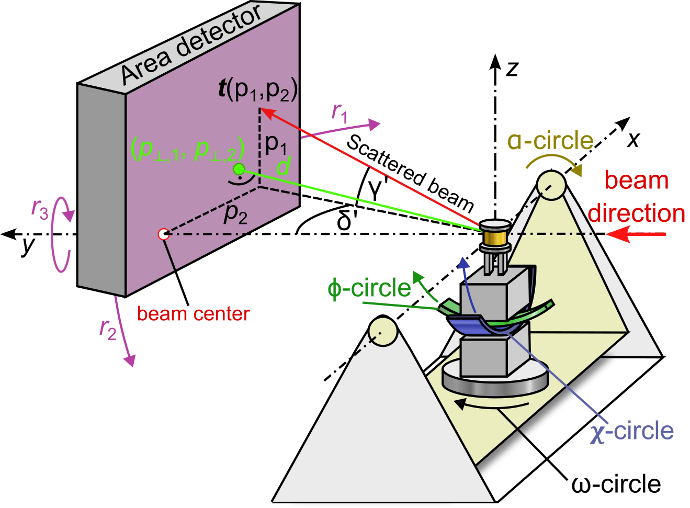

orGUI: Orientation and Integration with 2D Detectors
====================================================

.. |logo| image:: ./orgui/resources/icons/logo.svg
   :height: 320px

.. |docs| image:: https://readthedocs.org/projects/orgui/badge/?version=latest
   :target: https://orgui.readthedocs.io/en/latest/
   :alt: Documentation Status

.. |zenodo DOI| image:: https://zenodo.org/badge/DOI/10.5281/zenodo.12592485.svg
   :target: https://doi.org/10.5281/zenodo.12592485

|docs| |zenodo DOI|

|logo|

orGUI is a Python GUI and analysis toolkit for surface X-ray diffraction data
from large 2D detectors. It helps determine single-crystal orientations,
calculate diffractometer settings, and integrate stationary or rocking scans in
reciprocal-space coordinates.

Its primary use cases are High Energy Surface X-ray Diffraction
(`HESXRD <https://doi.org/10.1126/science.1246834>`_) and Transmission Surface
Diffraction (`TSD <https://doi.org/10.1021/acs.jpclett.7b00332>`_).

Geometry and Detector Calibration
---------------------------------

orGUI uses the six-circle surface-diffraction convention of
`Lohmeier and Vlieg <https://doi.org/10.1107/S0021889893004868>`_, with
orGUI-specific modifications: the ``phi`` circle rotates around ``x`` instead
of ``z``, the machine ``azimuth`` rotates the diffractometer around the
incident beam, and the ID31-style theta axis is represented internally as
:math:`\theta = -\omega`. In the laboratory frame, ``y`` points along the beam,
``z`` is set by the azimuth direction, and ``x`` is perpendicular to both.

The detector geometry follows the
`pyFAI <https://pyfai.readthedocs.io/en/stable/>`_ convention. Detector
calibrations from pyFAI, including ``.poni`` files from calibration standards,
can be used to map detector pixels to scattering angles and reciprocal-space
coordinates.

|diffractometer|

Integration Modes
-----------------

* **Stationary reciprocal-space integration:** Integrates a scan along a line
  in reciprocal lattice coordinates, such as a crystal truncation rod (CTR). orGUI
  calculates the line intersections with the Ewald sphere and places ROIs at
  the corresponding detector positions. Each image produces one I(hkl).
  This is the fasted way to get integrated CTRs from large 2D detectors.

* **Fixed-pixel integration:** Integrates a detector ROI at a fixed pixel
  position. Corresponds to a conventional rocking scan if motors are moved. 
  This is often useful for time-resolved measurements.

* **Rocking reciprocal-space integration:** Defines a reciprocal-space line
  and integrates multiple ROIs along the line as rocking scans. This is
  often useful for quantitative CTR extraction because the rocking dimension
  helps separate signal from background and improves CTR resolution at low Qz.

* **Rocking Bragg integration:** Calculates allowed Bragg peaks and their position 
  on the detector from the crystal, UB matrix, detector calibration, strain,
  then integrates those positions as rocking scans.

Documentation
-------------

The documentation is available on Read the Docs:

https://orgui.readthedocs.io/en/latest/

Further Reading
---------------

The geometry and orientation-matrix workflows build on:

* W. R. Busing and H. A. Levy, Acta Crystallographica 22, 457-464 (1967).
* M. Lohmeier and E. Vlieg, Journal of Applied Crystallography 26, 706-716
  (1993), https://doi.org/10.1107/S0021889893004868.

Installation
------------

Install orGUI with its full GUI and analysis dependency set:

.. code-block:: bash

   pip install orGUI[full]

For a minimal install:

.. code-block:: bash

   pip install orGUI

License
-------

orGUI is licensed under the MIT license.

Citation
--------

orGUI releases can be cited via their DOI on Zenodo:

https://doi.org/10.5281/zenodo.12592485
