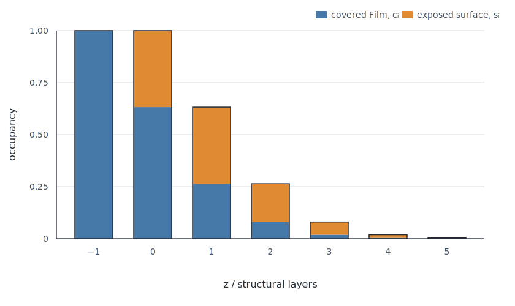

CTR Structure-Factor Normalization
==================================

The CTR calculation API uses canonical structure-factor units throughout:
every public ``F`` or ``F_uc`` method returns a complex scattering amplitude
in electrons.

.. warning::

   This convention changes amplitudes produced by older releases that divided
   unit-cell factors by area or volume. Legacy reference amplitudes and fitted
   experimental scale factors must be migrated by the corresponding constant
   normalization factor. Intensities change by the square of that factor.

Unit-cell amplitudes
--------------------

``UnitCell.F_uc`` returns

.. math::

   F_{\mathrm{uc}}(\mathbf{Q})
   = \sum_i o_i f_i(\mathbf{Q})
     \exp\left(i\mathbf{Q}\cdot\mathbf{r}_i\right),

including coherent-domain occupancies and displacement factors. No unit-cell
area or volume normalization is applied.

``Film.F_uc`` and ``PoissonSurface.F_uc`` sum their generated layer amplitudes
and return electrons for one lateral unit cell of their source
``UnitCell``.

Surface structure on a rough Film
---------------------------------

A ``PoissonSurface`` is stacked immediately above a ``Film`` and replaces the
Film structure only on the fraction that is truly exposed.  Let
:math:`\theta_i` be the cumulative material occupancy of structural layer
:math:`i`, ordered from bottom to top.  Its exposed surface occupancy is

.. math::

   s_i = \theta_i - \theta_{i+1},

where the occupancy above the highest represented layer is set to zero.  The
part of layer :math:`i` that is covered by another layer remains Film material
with occupancy

.. math::

   c_i = \theta_i - s_i.

The sharp Film already supplies occupancy :math:`\chi_{i<0}` below its nominal
boundary.  Before applying a reconstructed surface structure,
``PoissonSurface`` adds the rough-Film correction

.. math::

   \Delta F_{\mathrm{rough}}
   = \sum_i \left(\theta_i-\chi_{i<0}\right)F_{\mathrm{Film},i}.

The exposed fraction is subsequently replaced by a termination-specific
surface slab as described below.  Film and surface structures can consequently
occur at the same terrace height on complementary lateral fractions.

   Occupancy decomposition for ``PoissonProfile(mean_change=2, alpha=0.5)``.
   Each bar has total height :math:`\theta_i`; its orange segment is the true
   surface fraction :math:`s_i`, and its blue segment is covered Film
   :math:`c_i`.

Termination-specific relaxed surface slabs
-------------------------------------------

A reconstructed surface generally does not repeat the bulk layer cycle.  The
``layer`` column therefore has a narrower meaning for a surface slab: it
selects the Film termination to which the *complete slab* belongs.  Internal
planes of that slab are distinguished by their z coordinates, not by cycling
layer identifiers.  ``UnitCell.as_surface_termination`` makes this explicit by
assigning one termination identifier to every atom and setting
``layer_behavior="select"``.  Selection masks an inactive cell during the
calculation; it does not overwrite atomic occupancy fit parameters.

A ``PoissonSurface`` owns exactly one complete unit cell for every member of
the underlying Film's primitive stacking cycle.  For a two-layer RuO2 Film,
this means two termination cells regardless of how many bulk cells deep each
surface slab is.  The surface-normal length of every termination cell may be
an integer multiple of the Film c axis, while its lateral lattice constants and
lattice angles must match the Film.

Surface-supercell generation example
^^^^^^^^^^^^^^^^^^^^^^^^^^^^^^^^^^^^

``CTRutil.generate_surface_termination_cells`` automates the affine cycling,
top-plane selection, naming, and whole-slab relabeling.  For example, a
two-cell-deep RuO2 slab and both of its surface terminations can be built as

.. code-block:: python

   from orgui.datautils.xrayutils.CTRdistributions import PoissonProfile
   from orgui.datautils.xrayutils.CTRfilm import PoissonSurface
   from orgui.datautils.xrayutils.CTRutil import (
       generate_surface_termination_cells,
   )

   slab = ruo2_surface.supercell((1, 1, 2), symmetry="independent")
   terminations = generate_surface_termination_cells(
       slab,
       ruo2_film,
       name_template="RuO2_termination_{layer:g}",
   )

   surface = PoissonSurface(
       terminations,
       profile=PoissonProfile(mean_change=-0.55, alpha=0.5),
   )

Here ``ruo2_film`` may be the underlying ``Film``, its ``UnitCell``, its
``LayerCycle``, or simply the ordered tuple ``(1, 2)``.  The number of internal
layers in ``slab`` must be an integer multiple of this primitive Film-cycle
length.  ``symmetry="independent"`` gives repeated copies independent Wyckoff
sites; use ``symmetry="preserve"`` when all repeats should retain shared
symmetry parameters.

The helper chooses which original plane is at the top of each generated slab
and then assigns the complete slab to that Film-cycle state.  Atoms at the
selected top plane can consequently be relaxed independently of their former
internal layer numbers.  The returned termination cells are separate objects
and can carry independent coordinate, displacement-factor, occupancy, and
Wyckoff fit parameters.  The same mapping contract can be consumed by other
surface-roughness models; it is not specific to ``PoissonSurface``.

At exposed terrace :math:`i`, let :math:`t_i` be the corresponding Film-cycle
termination.  CTRcalc generates a bulk-reference slab with the same depth and
alignment as the selected surface slab and adds

.. math::

   \Delta F_{\mathrm{termination}}
   = \sum_i s_i
     \left(
       F_{\mathrm{surface\ slab},t_i}
       - F_{\mathrm{Film\ slab},t_i}
     \right).

Thus a multi-layer relaxed slab replaces, rather than duplicates, the same
depth of Film material.  If every termination slab is identical to its Film
reference, this term cancels numerically in ``F_uc``, ``zDensity_G``, and the
optical profile.  A zero-width distribution selects and replaces only the
single sharp termination.

The immediately underlying ``Film`` and its current stacking phase are inferred
when ``SXRDCrystal`` applies stacking; no Film reference is serialized.
Termination banks are stored in ``.xtal`` and ``.xpr`` files as
``TerminationUnitCell <layer> <name>`` sections.  A legacy single ``UnitCell``
surface remains readable and is expanded automatically into one termination
variant per Film-cycle state.

An ``EpitaxyInterface`` can join materials with different lateral areas. Its
canonical lateral cell is the lower unit cell. Internally it combines the
upper and lower amplitudes as

.. math::

   F_{\mathrm{interface}}
   = A_{\mathrm{lower}}
     \left(
       \frac{F_{\mathrm{upper}}}{A_{\mathrm{upper}}}
       + \frac{F_{\mathrm{lower}}}{A_{\mathrm{lower}}}
     \right).

The result is therefore in electrons per lower interface cell.

Crystal composition
-------------------

``SXRDCrystal`` automatically uses its bulk unit cell as the reciprocal-space
and lateral-area reference unless ``reference_uc`` is supplied explicitly.
The constructor propagates that reference to every source and generated layer
unit cell.

For each crystal component :math:`j`, ``SXRDCrystal.F`` evaluates

.. math::

   F_{\mathrm{crystal}}
   = \frac{A_{\mathrm{ref}}}{A_{\mathrm{bulk}}}F_{\mathrm{bulk}}
     + \sum_j
       w_j d_j
       \frac{A_{\mathrm{ref}}}{A_j}F_j ,

where:

* :math:`A_{\mathrm{ref}}` is ``reference_uc.uc_area``;
* :math:`A_j` is the component ``uc_area``;
* :math:`w_j` is the dimensionless crystal-component weight;
* :math:`d_j` is a dimensionless coherent-domain occupancy.

Thus ``SXRDCrystal.F`` returns electrons per reference lateral cell and is
invariant when a component is replaced by an equivalent in-plane supercell.
No illuminated footprint, detector response, or experimental scale factor is
included. Calculated intensity is proportional to
:math:`|F_{\mathrm{crystal}}|^2`.

API reference
-------------

.. autoclass:: orgui.datautils.xrayutils.CTRdistributions.SurfaceProfile
   :members: support, occupancy, correction, surface_occupancy
   :member-order: bysource

.. autoclass:: orgui.datautils.xrayutils.CTRdistributions.PoissonProfile
   :members:
   :member-order: bysource

.. autoclass:: orgui.datautils.xrayutils.CTRcalc.SXRDCrystal
   :members: F, F_surf, setGlobalReferenceUnitCell
   :member-order: bysource

.. autoclass:: orgui.datautils.xrayutils.CTRuc.UnitCell
   :members: F_uc, F_bulk, setReferenceUnitCell, supercell, affine_layer_transform, as_surface_termination
   :member-order: bysource

.. autoclass:: orgui.datautils.xrayutils.CTRfilm.Film
   :members: F_uc, uc_area, setReferenceUnitCell
   :member-order: bysource

.. autoclass:: orgui.datautils.xrayutils.CTRfilm.EpitaxyInterface
   :members: F_uc, uc_area, setReferenceUnitCell
   :member-order: bysource

.. autoclass:: orgui.datautils.xrayutils.CTRfilm.PoissonSurface
   :members: F_uc, uc_area, setReferenceUnitCell
   :member-order: bysource

.. autofunction:: orgui.datautils.xrayutils.CTRutil.generate_surface_termination_cells
