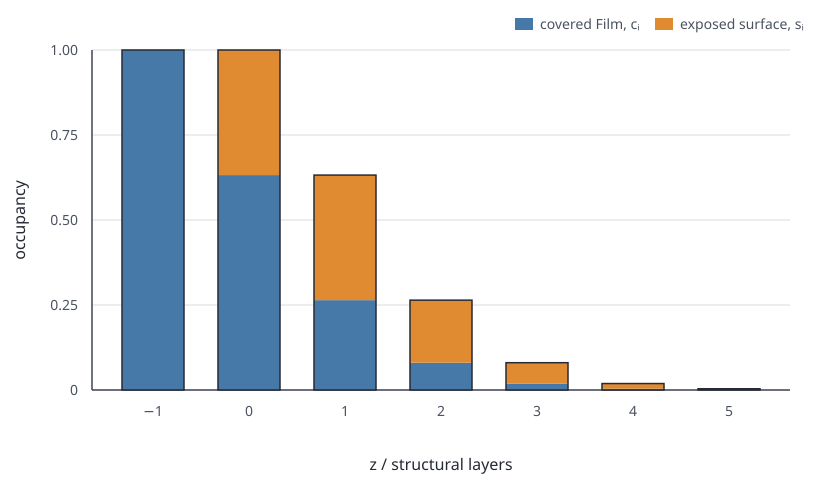
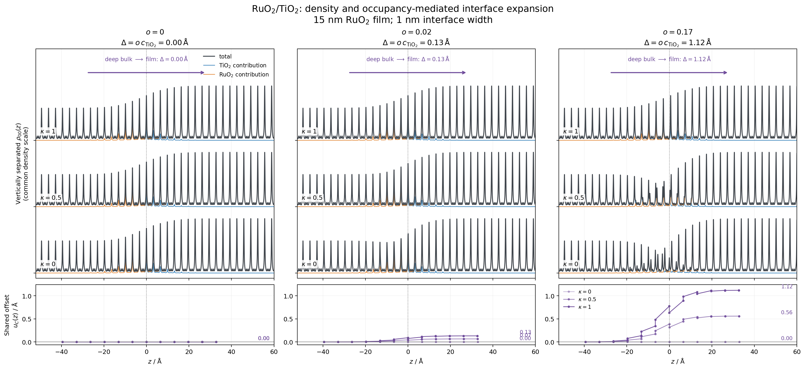

CTR Structure-Factor Normalization
==================================

The CTR calculation API uses canonical structure-factor units throughout:
every public ``F`` or ``F_uc`` method returns a complex scattering amplitude
in electrons.

.. warning::

   This convention changes amplitudes produced by older releases that divided
   unit-cell factors by area or volume. Legacy reference amplitudes and fitted
   experimental scale factors must be migrated by the corresponding constant
   normalization factor. Intensities change by the square of that factor.

Unit-cell amplitudes
--------------------

``UnitCell.F_uc`` returns

.. math::

   F_{\mathrm{uc}}(\mathbf{Q})
   = \sum_i o_i f_i(\mathbf{Q})
     \exp\left(i\mathbf{Q}\cdot\mathbf{r}_i\right),

including coherent-domain occupancies and displacement factors. No unit-cell
area or volume normalization is applied.

``Film.F_uc`` and ``PoissonSurface.F_uc`` sum their generated layer amplitudes
and return electrons for one lateral unit cell of their source
``UnitCell``.

Semi-infinite bulk amplitude
-----------------------------

``UnitCell.F_bulk`` sums ``UnitCell.F_uc_bulk_direct`` over an infinite stack
of bulk repeats along the out-of-plane direction using a closed-form
geometric series with attenuation:

.. math::

   F_{\mathrm{bulk}}(\mathbf{Q})
   = \frac{F_{\mathrm{uc,bulk}}(\mathbf{Q})}
     {1 - \exp\left(-2\pi i\, l_{\mathrm{bulk}} - \mathrm{atten}\right)},

where :math:`l_{\mathrm{bulk}}` is the out-of-plane reciprocal index *after*
conversion from the reference unit cell via ``refHKLTransform``, i.e. the
third component of ``refHKLTransform @ (h, k, l)``. This is the same index
used to phase every atom in ``F_uc_bulk_direct``, so the phase advance per
bulk repeat in the denominator is consistent with the periodicity actually
being summed.

.. warning::

   Versions up to and including v1.5.0 used the raw, untransformed ``l`` in
   this denominator instead of the reference-transformed index. This was only
   correct when ``refHKLTransform``'s third row equals ``(0, 0, 1)``, i.e.
   only when the bulk cell's own out-of-plane reciprocal axis exactly
   coincides with the reference cell's, in both direction and length. Since
   ``refHKLTransform = B_mat_inv @ rotMatrix @ uc.B_mat`` (see
   ``UnitCell.setReferenceUnitCell``), this held only for the default case of
   a component using its own bulk cell as the reference (no ``reference_uc``
   set). Any explicit ``reference_uc`` whose out-of-plane reciprocal axis
   differs from the bulk's was affected — including a plain scale difference
   between the reference and bulk out-of-plane axis length, not only a
   rotated or reindexed reference.

Bulk distorted-wave Born amplitude
-----------------------------------

``SXRDCrystal.F_DWBA`` evaluates the four Renaud distorted-wave channels for
one bulk unit cell or its semi-infinite repetition.  This first increment is
deliberately bulk-only: a crystal containing surface or film components is
rejected until those components are connected to the same graded-interface
path.

The optical solver uses the signed normal wavevector

.. math::

   k_{z,j}=-k_0\sqrt{n_j^2-n_0^2\cos^2\alpha},
   \qquad \Re k_{z,j}\leq0,\quad\Im k_{z,j}\geq0,

and stores downward and upward field amplitudes as ``A_plus`` and
``A_minus``.  All core optical glancing angles, including
``SXRDCrystal.wavefield`` and ``SXRDCrystal.specular_reflectivity``, are in
radians.  ``sample_electric_field`` samples a ``LayeredElectricField`` only
when local field values are needed.

For channel signs :math:`\sigma_i,\sigma_f\in\{+1,-1\}`, the native kernel
uses

.. math::

   Q_{z,j}^{\sigma_i\sigma_f}
   =-\left(\sigma_i k_{zj,i}+\sigma_f k_{zj,f}\right).

The reciprocal exit field is solved from the same complex refractive profile
without conjugating its amplitudes.  Explicit ``"s"`` and ``"p"`` input and
output polarizations are contracted as local Maxwell field vectors.  Each
channel receives its own generally complex :math:`Q^2`, Waasmaier--Kirfel
factor, anisotropic Debye--Waller factor, and reference-position phase.

The terminal substrate enforces :math:`A_i^-=A_f^-=0`, so only the ``++``
channel survives for the current bulk-only model.  In ``"semi_infinite"``
mode that channel is summed before the coherent channel total:

.. math::

   F_{\mathrm{bulk},\nu}
   =\frac{\displaystyle
      \sum_a F_{a,\nu}\exp(\eta z_{a,\mathrm{rel}})}
   {1-\exp[-i\mathbf Q_\nu\cdot\mathbf c-\eta]}.

``bulk_attenuation`` supplies the optional empirical exponent :math:`\eta`
per bulk repeat.  The intra-cell factor uses the same transformed fractional
depth :math:`z_{a,\mathrm{rel}}` as the kinematical bulk sum, so the envelope
is continuous at unit-cell boundaries.  It defaults to zero because the
complex DWBA wavevectors already describe physical X-ray absorption.  A
nonzero value is retained for controlled comparisons with kinematical models;
setting it to zero is allowed away from a pole, while an exact Bragg pole is
rejected.

For a kinematical comparison at fixed incidence,
``CTRutil.set_atten_from_dwba(crystal, alpha_i)`` populates the scalar
``crystal.atten`` from the exact incident-path normal wavevector.  An optional
scalar ``alpha_f`` includes the reciprocal exit path as well.  The equivalent
attenuation per reference-cell repeat is

.. math::

   \mathrm{atten}
   =\frac{|c_z|}{|T_{zz}|}
    \left[\Im k_{z,\mathrm{bulk}}(\alpha_i)
    +\Im k_{z,\mathrm{bulk}}(\alpha_f)\right],

where :math:`T` is ``refHKLTransform``.  Omitting ``alpha_f`` omits its term
and gives the large-exit-angle plateau used as a constant-incidence
approximation.  ``CTRutil.attenuation_from_dwba`` provides the same calculation
without mutation and accepts broadcast angle arrays for diagnostics.  There is
no single exact scalar attenuation along a fixed-incidence rod because the
exit angle changes with ``l``.

For repeated atomic evaluations, call ``prepare_DWBA`` once and pass its
immutable ``PreparedDWBA`` result to ``F_DWBA_prepared``.  Preparation performs
the incident and reciprocal-exit optical solves and validates the Ewald
geometry.  Prepared evaluation performs no wavefield solve and reads current
bulk atom, disorder, occupancy, form-factor, and coherent-domain parameters.
Changing energy, lattice or reference transforms, hkl, angles, polarization,
or the intended optical profile requires preparation again.

Diffractometer angles from the Vlieg z-mode
^^^^^^^^^^^^^^^^^^^^^^^^^^^^^^^^^^^^^^^^^^^

``prepare_DWBA`` requires explicit glancing angles.  For a scan that follows a
diffractometer angle constraint rather than a pair of angles,
``SXRDCrystal.prepare_DWBA_Zmode`` derives them from
``HKLVlieg.VliegAngles.anglesZmode`` and prepares the same state:

.. code-block:: python

   prepared, angles = crystal.prepare_DWBA_Zmode(
       2.0, 0.0, L, np.deg2rad(0.2), fixed="in", return_angles=True
   )
   F = crystal.F_DWBA_prepared(prepared)

``fixed`` selects the z-mode constraint — ``"in"`` for a fixed incidence angle
``alpha``, ``"out"`` for a fixed exit angle ``gamma``, and ``"eq"`` for the
equal-angle constraint used on the specular rod, where ``fixedangle`` has no
effect.  All parameters the crystal already knows are populated from it: the
bulk cell is the lattice, its energy sets the wavelength, ``h``, ``k``, and
``l`` are in reference-cell r.l.u. and pass through ``refHKLTransform``, and
the orientation matrix is ``U = 1`` so that the crystal cartesian frame is the
z-mode sample frame at all-zero angles.  The surface normal is then the omega
axis, which is what the layered DWBA optics assume, and consequently only
``chi = phi = 0`` is accepted: a tilted inner sample circle would make
``alpha`` and ``gamma`` differ from the glancing angles of the optics.

``return_angles`` additionally yields the six z-mode angles ``(alpha, delta,
gamma, omega, chi, phi)`` in radians, following the shape convention of
``anglesZmode``.  A reflection that the constraint cannot reach, or one whose
glancing angles leave ``(0, pi/2]``, is rejected with the offending ``hkl``.
``examples/CTR/pt100_dwba_ctr_example.ipynb`` calculates the specular ``(0 0 L)``
and non-specular ``(2 0 L)`` rods of Pt(100) this way and compares them with
the kinematical bulk amplitude.

Glancing angles as the scan variable
^^^^^^^^^^^^^^^^^^^^^^^^^^^^^^^^^^^^

Near the critical angle ``l`` is a poor scan variable: a rod is sub-critical
only over a thin ``l`` interval — below ``l = 0.053`` for the specular rod of
Pt(100) at 20 keV — so the whole interesting range collapses towards ``l = 0``.
The glancing angle is the natural parameter there, and
``SXRDCrystal.prepare_DWBA_from_angles`` is the counterpart of
``prepare_DWBA_Zmode`` that accepts it: the in-plane indices and both glancing
angles are given, and ``l`` is derived rather than the angles:

.. code-block:: python

   prepared, l = crystal.prepare_DWBA_from_angles(
       2.0, 0.0, np.deg2rad(0.2), alpha_f, return_l=True
   )
   F = crystal.F_DWBA_prepared(prepared)

The conversion itself is public as
``SXRDCrystal.l_from_glancing_angles(h, k, alpha_i, alpha_f)``, for callers
that want to pass the result to ``prepare_DWBA`` themselves and have its Ewald
check verify the round trip.  It solves

.. math::

   Q_z = k_0\left(\sin\alpha_i+\sin\alpha_f\right)

for ``l``, which is linear because ``B_mat @ refHKLTransform`` maps reference
r.l.u. to cartesian :math:`\mathbf Q`.  The solve is rejected when the
reference out-of-plane axis has no surface-normal component, since ``Q_z`` is
then independent of ``l``.  The conversion is purely kinematic and does not
restrict the angle range; ``prepare_DWBA`` still enforces ``(0, pi/2]``.  The
two convenience APIs are exact inverses: feeding a derived ``l`` back through
``prepare_DWBA_Zmode`` returns the angles it was derived from.

Surface structure on a rough Film
---------------------------------

A ``PoissonSurface`` is stacked immediately above a ``Film`` and replaces the
Film structure only on the fraction that is truly exposed.  Let
:math:`\theta_i` be the cumulative material occupancy of structural layer
:math:`i`, ordered from bottom to top.  Its exposed surface occupancy is

.. math::

   s_i = \theta_i - \theta_{i+1},

where the occupancy above the highest represented layer is set to zero.  The
part of layer :math:`i` that is covered by another layer remains Film material
with occupancy

.. math::

   c_i = \theta_i - s_i.

The sharp Film already supplies occupancy :math:`\chi_{i<0}` below its nominal
boundary.  Before applying a reconstructed surface structure,
``PoissonSurface`` adds the rough-Film correction

.. math::

   \Delta F_{\mathrm{rough}}
   = \sum_i \left(\theta_i-\chi_{i<0}\right)F_{\mathrm{Film},i}.

The exposed fraction is subsequently replaced by a termination-specific
surface slab as described below.  Film and surface structures can consequently
occur at the same terrace height on complementary lateral fractions.

   Occupancy decomposition for ``PoissonProfile(mean_change=2, alpha=0.5)``.
   Each bar has total height :math:`\theta_i`; its orange segment is the true
   surface fraction :math:`s_i`, and its blue segment is covered Film
   :math:`c_i`.

Termination-specific relaxed surface slabs
-------------------------------------------

A reconstructed surface generally does not repeat the bulk layer cycle.  The
``layer`` column therefore has a narrower meaning for a surface slab: it
selects the Film termination to which the *complete slab* belongs.  Internal
planes of that slab are distinguished by their z coordinates, not by cycling
layer identifiers.  ``UnitCell.as_surface_termination`` makes this explicit by
assigning one termination identifier to every atom and setting
``layer_behavior="select"``.  Selection masks an inactive cell during the
calculation; it does not overwrite atomic occupancy fit parameters.

A ``PoissonSurface`` owns exactly one complete unit cell for every member of
the underlying Film's primitive stacking cycle.  For a two-layer RuO2 Film,
this means two termination cells regardless of how many bulk cells deep each
surface slab is.  The surface-normal length of every termination cell may be
an integer multiple of the Film c axis, while its lateral lattice constants and
lattice angles must match the Film.

Surface-supercell generation example
^^^^^^^^^^^^^^^^^^^^^^^^^^^^^^^^^^^^

``CTRutil.generate_surface_termination_cells`` automates the affine cycling,
top-plane selection, naming, and whole-slab relabeling.  For example, a
two-cell-deep RuO2 slab and both of its surface terminations can be built as

.. code-block:: python

   from orgui.datautils.xrayutils.CTRdistributions import PoissonProfile
   from orgui.datautils.xrayutils.CTRfilm import PoissonSurface
   from orgui.datautils.xrayutils.CTRutil import (
       generate_surface_termination_cells,
   )

   slab = ruo2_surface.supercell((1, 1, 2), symmetry="independent")
   terminations = generate_surface_termination_cells(
       slab,
       ruo2_film,
       name_template="RuO2_termination_{layer:g}",
   )

   surface = PoissonSurface(
       terminations,
       profile=PoissonProfile(mean_change=-0.55, alpha=0.5),
   )

Here ``ruo2_film`` may be the underlying ``Film``, its ``UnitCell``, its
``LayerCycle``, or simply the ordered tuple ``(1, 2)``.  The number of internal
layers in ``slab`` must be an integer multiple of this primitive Film-cycle
length.  ``symmetry="independent"`` gives repeated copies independent Wyckoff
sites; use ``symmetry="preserve"`` when all repeats should retain shared
symmetry parameters.

The helper chooses which original plane is at the top of each generated slab
and then assigns the complete slab to that Film-cycle state.  Atoms at the
selected top plane can consequently be relaxed independently of their former
internal layer numbers.  The returned termination cells are separate objects
and can carry independent coordinate, displacement-factor, occupancy, and
Wyckoff fit parameters.  The same mapping contract can be consumed by other
surface-roughness models; it is not specific to ``PoissonSurface``.

At exposed terrace :math:`i`, let :math:`t_i` be the corresponding Film-cycle
termination.  CTRcalc generates a bulk-reference slab with the same depth and
alignment as the selected surface slab and adds

.. math::

   \Delta F_{\mathrm{termination}}
   = \sum_i s_i
     \left(
       F_{\mathrm{surface\ slab},t_i}
       - F_{\mathrm{Film\ slab},t_i}
     \right).

Thus a multi-layer relaxed slab replaces, rather than duplicates, the same
depth of Film material.  If every termination slab is identical to its Film
reference, this term cancels numerically in ``F_uc``, ``zDensity_G``, and the
optical profile.  A zero-width distribution selects and replaces only the
single sharp termination.

The immediately underlying ``Film`` and its current stacking phase are inferred
when ``SXRDCrystal`` applies stacking; no Film reference is serialized.
Termination banks are stored in ``.xtal`` and ``.xpr`` files as
``TerminationUnitCell <layer> <name>`` sections.  A legacy single ``UnitCell``
surface remains readable and is expanded automatically into one termination
variant per Film-cycle state.

Epitaxy-interface strain coupling and offset
---------------------------------------------

An ``EpitaxyInterface`` can join materials with different lateral areas.  Its
canonical lateral cell is the lower unit cell.  Internally it combines the
upper and lower amplitudes as

.. math::

   F_{\mathrm{interface}}
   = A_{\mathrm{lower}}
     \left(
       \frac{F_{\mathrm{upper}}}{A_{\mathrm{upper}}}
       + \frac{F_{\mathrm{lower}}}{A_{\mathrm{lower}}}
     \right).

The result is therefore in electrons per lower interface cell.

The lower material is a correction to the semi-infinite bulk, whose atoms
remain at their unstrained positions below the nominal interface boundary.
For every represented lower-material layer, the interface therefore adds its
distributed occupancy at the strain-field position and subtracts the
corresponding sharp-bulk occupancy at the original bulk-lattice position.
This remains true when the statistical support extends below zero.  The
subtraction is deliberately *not* strained: it removes the density already
present in the sharp, semi-infinite bulk before the distributed replacement
is added.

Coordinate model
^^^^^^^^^^^^^^^^

The dimensionless ``strain_coupling`` parameter, written :math:`\kappa`,
controls the out-of-plane lattice transition, with
:math:`0\leq\kappa\leq1`.  It does not control whether film and bulk
amplitudes scatter coherently; those amplitudes are always summed as complex
structure factors.  Let :math:`z_{0,m}` be an atom's position on the
independent lattice of material :math:`m`, and let :math:`z_1` be its position
in the fully strain-coupled, zero-offset field.  Strain coupling alone gives
the linear interpolation

.. math::

   z_m(\kappa,0)
   = z_{0,m} + \kappa\left(z_1-z_{0,m}\right).

For the fully strain-coupled discrete profile, every structural layer supplies
its own physical interval.  If :math:`d_{\mathrm{top},i}` and
:math:`d_{\mathrm{bottom},i}` are the upper- and lower-lattice intervals for
layer :math:`i`, the coupled interval is

.. math::

   d_{1,i}
   = P_i d_{\mathrm{top},i}
     + (1-P_i)d_{\mathrm{bottom},i},

and the layer origins are the cumulative sum of these intervals.  The
calculation must therefore accumulate all structural layers independently;
one layer's strain cannot represent a complete multi-layer unit-cell cycle.

The ``offset`` parameter :math:`o` is expressed in fractional lower-bulk
:math:`c` coordinates.  Its physical displacement is

.. math::

   \Delta = o\,c_{\mathrm{bulk}}.

Positive :math:`o` points toward increasing :math:`z`.  Let :math:`P_i` be
the upper-material occupancy at represented interface layer :math:`i`.  The
profile used for the offset field is normalized over the complete represented
statistical support,

.. math::

   \widehat P_i
   = \frac{P_i-P_{\mathrm{deep\ bulk}}}
          {P_{\mathrm{film}}-P_{\mathrm{deep\ bulk}}},
   \qquad
   \widehat P_{\mathrm{deep\ bulk}}=0,\quad
   \widehat P_{\mathrm{film}}=1.

Using this occupancy coordinate, the generated upper- and lower-material
positions are

.. math::

   z_{\mathrm{top}}(\kappa,o)
   &= z_{0,\mathrm{top}}
      + \kappa(z_1-z_{0,\mathrm{top}})
      + \Delta\left[(1-\kappa)+\kappa\widehat{P}(z)\right], \\
   z_{\mathrm{bottom}}(\kappa,o)
   &= z_{0,\mathrm{bottom}}
      + \kappa(z_1-z_{0,\mathrm{bottom}})
      + \Delta\kappa\widehat{P}(z).

The offset terms have a useful decomposition:

.. math::

   u_{\mathrm{top}}(z)
   &= \Delta(1-\kappa) + \kappa\Delta\widehat P(z),\\
   u_{\mathrm{bottom}}(z)
   &= \kappa\Delta\widehat P(z).

The first term is a rigid registry offset between two independent lattices.
The second is a shared displacement field that expands or contracts the
interface as a whole.  Their difference is independent of :math:`z`,

.. math::

   u_{\mathrm{top}}-u_{\mathrm{bottom}}=(1-\kappa)\Delta,

while the shared displacement accumulated from deep bulk to film is

.. math::

   u_\kappa(\mathrm{film})
   -u_\kappa(\mathrm{deep\ bulk})
   =\kappa\Delta.

Equivalently, wherever the occupancy profile is differentiable, the additional
local strain due to the offset is

.. math::

   \epsilon_o(z)
   = \frac{\mathrm{d}u_C}{\mathrm{d}z}
   = \kappa\Delta\frac{\mathrm{d}\widehat P}{\mathrm{d}z}.

This separates three named regimes:

.. list-table::
   :header-rows: 1
   :widths: 18 25 32 25 22

   * - ``strain_coupling``
     - Regime
     - Atomic positions
     - Residual registry offset
     - Shared expansion
   * - ``0``
     - Independent-lattice limit
     - Both materials retain their independent ideal lattice spacings.
     - :math:`\Delta`
     - :math:`0`
   * - ``0.5``
     - Partially strain-coupled interface
     - Half of the strain and offset field is applied.
     - :math:`\Delta/2`
     - :math:`\Delta/2`
   * - ``1``
     - Fully strain-coupled interface
     - Both distributed materials follow the same strain field.
     - :math:`0`
     - :math:`\Delta`

Thus :math:`\kappa=0` is the **independent-lattice limit**,
:math:`0<\kappa<1` is a **partially strain-coupled interface**, and
:math:`\kappa=1` is the **fully strain-coupled interface**.  In the
independent-lattice limit the lower material remains on its bulk lattice and
the upper material remains on its own lattice, translated rigidly by
:math:`\Delta`; there is no strain field.  In the fully strain-coupled limit,
coincident lattices receive identical occupancy-mediated displacements and
therefore remain coincident.  Intermediate strain coupling continuously
partitions :math:`\Delta` between rigid registry and shared interface strain.

The strain-coupled field is anchored to the unstrained deep bulk at the lower
edge of the represented statistical support.  Its accumulated displacement is
propagated upward rather than removed by re-anchoring at the nominal boundary.
The complete Film and all subsequently stacked surface, water, and other
components receive the full :math:`\Delta` translation without a thickness
change.  The fixed sharp-bulk subtraction, semi-infinite bulk, and nominal
statistical boundary remain unchanged.

The conventional epitaxial *relaxation degree* uses the opposite endpoint
direction: :math:`R=0` denotes a pseudomorphic, fully strained layer and
:math:`R=1` a layer at its relaxed lattice constant.  Consequently,
``strain_coupling`` is qualitatively analogous to :math:`1-R`, but it is not
the same model: :math:`\kappa` controls an occupancy-mediated, depth-dependent
out-of-plane coordinate field shared by both interface materials, rather than
a uniform in-plane film lattice parameter.  See `Zhylik et al., Journal of
Applied Crystallography 46, 919--925 (2013)
<https://doi.org/10.1107/S0021889813011907>`_ for the conventional relaxation
definition and its diffraction treatment.

Newly serialized interfaces use the explicit four-column header
``Width/cells Skew/cells StrainCoupling Offset/bulk_frac``.  ``.xtal`` and
``.xpr`` models written by orGUI v1.5.0 used the two-column header
``Width/cells Skew/cells``; these records remain readable and are interpreted
as :math:`\kappa=1` and :math:`o=0`, preserving the fully strain-coupled,
zero-offset model.  Saving the reconstructed model writes the current
four-column form.

The optional companion ``.h5`` file contains fit definitions rather than a
separate crystal model.  A v1.5.0 two-element interface baseline stored there
is likewise expanded to ``[Width, Skew, 1, 0]`` when loaded.  Existing Width
and Skew fit parameters retain their original indices; ``strain_coupling`` and
``offset`` become fit parameters only when explicitly selected.

RuO2 on TiO2 example
^^^^^^^^^^^^^^^^^^^^

The following density profiles use a 15 nm RuO2 film on TiO2 with a 1 nm
Skellam interface width.  The columns use offsets :math:`o=0`, :math:`0.02`,
and :math:`0.17`.  For the TiO2 lower-bulk lattice
:math:`c_{\mathrm{bulk}}=6.5807` Angstrom, these correspond to
:math:`\Delta=0`, :math:`0.13`, and :math:`1.12` Angstrom.  Each column
vertically separates the :math:`\kappa=0`, :math:`\kappa=0.5`, and
:math:`\kappa=1` densities.
Gray is the summed density, blue is the TiO2 contribution including the
semi-infinite bulk and lower-interface correction, and orange is the RuO2
interface-plus-film contribution.

   Strain coupling partitions the physical offset into rigid registry and
   shared interface expansion.  Arrows above the density panels indicate the
   full bulk-to-film displacement :math:`\Delta`.  The lower panels show the
   shared displacement :math:`u_\kappa(z)` obtained from the generated
   lower-material domain transforms; its film-side plateau is
   :math:`\kappa\Delta`.

The :math:`\kappa=0` density peaks show two independently periodic lattices:
the TiO2 peaks retain the lower-bulk spacing, while the RuO2 peaks retain the
RuO2 film spacing and are shifted rigidly by :math:`\Delta`.  No density
feature is bent into a strain field.  At :math:`\kappa=1` the offset is
accumulated through the occupancy profile, so both distributed materials
follow the same displacement and the lower-panel curve rises from zero to
:math:`\Delta`.  The :math:`\kappa=0.5` row is the exact intermediate case:
half of the offset remains as registry separation and half appears as a
measurable expansion of the interface.

The lower curves are plotted at the represented lower-material layer
positions rather than inferred from peak maxima.  They therefore provide a
direct diagnostic of the coordinate transforms used by ``F_uc``,
``zDensity_G``, and the optical profile.

Crystal composition
-------------------

``SXRDCrystal`` automatically uses its bulk unit cell as the reciprocal-space
and lateral-area reference unless ``reference_uc`` is supplied explicitly.
The constructor propagates that reference to every source and generated layer
unit cell.

For each crystal component :math:`j`, ``SXRDCrystal.F`` evaluates

.. math::

   F_{\mathrm{crystal}}
   = \frac{A_{\mathrm{ref}}}{A_{\mathrm{bulk}}}F_{\mathrm{bulk}}
     + \sum_j
       w_j d_j
       \frac{A_{\mathrm{ref}}}{A_j}F_j ,

where:

* :math:`A_{\mathrm{ref}}` is ``reference_uc.uc_area``;
* :math:`A_j` is the component ``uc_area``;
* :math:`w_j` is the dimensionless crystal-component weight;
* :math:`d_j` is a dimensionless coherent-domain occupancy.

Thus ``SXRDCrystal.F`` returns electrons per reference lateral cell and is
invariant when a component is replaced by an equivalent in-plane supercell.
No illuminated footprint, detector response, or experimental scale factor is
included. Calculated intensity is proportional to
:math:`|F_{\mathrm{crystal}}|^2`.

API reference
-------------

.. autoclass:: orgui.datautils.xrayutils.CTRdistributions.SurfaceProfile
   :members: support, occupancy, correction, surface_occupancy
   :member-order: bysource

.. autoclass:: orgui.datautils.xrayutils.CTRdistributions.PoissonProfile
   :members:
   :member-order: bysource

.. autoclass:: orgui.datautils.xrayutils.CTRcalc.SXRDCrystal
   :members: F, F_surf, setGlobalReferenceUnitCell
   :member-order: bysource

.. autoclass:: orgui.datautils.xrayutils.CTRuc.UnitCell
   :members: F_uc, F_bulk, setReferenceUnitCell, supercell, affine_layer_transform, as_surface_termination
   :member-order: bysource

.. autoclass:: orgui.datautils.xrayutils.CTRfilm.Film
   :members: F_uc, uc_area, setReferenceUnitCell
   :member-order: bysource

.. autoclass:: orgui.datautils.xrayutils.CTRfilm.EpitaxyInterface
   :members: F_uc, uc_area, setReferenceUnitCell
   :member-order: bysource

.. autoclass:: orgui.datautils.xrayutils.CTRfilm.PoissonSurface
   :members: F_uc, uc_area, setReferenceUnitCell
   :member-order: bysource

.. autofunction:: orgui.datautils.xrayutils.CTRutil.generate_surface_termination_cells
