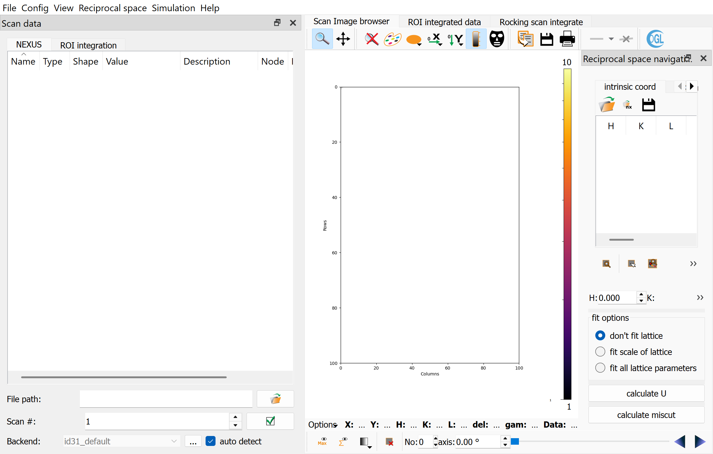

Entry Points
============

The installed command line entry point is ``orGUI``. It calls
``orgui.main:main`` and then starts either the normal Qt graphical user
interface (GUI) or the command-line interface (CLI) / headless startup path. In
both cases, the entry point prepares the runtime environment, loads the
requested orGUI configuration, creates the main orGUI application object, and
then either lets the user work interactively or runs a startup script passed
with ``-i``.

Both modes create the same top-level ``orgui.app.orGUI.orGUI`` object. The
main difference is how the object is used: GUI mode shows the application for
interactive work, while CLI mode keeps the application available for scripts,
batch jobs, or an embedded command-line session.

Command Line
------------

The usual startup forms are:

.. code-block:: bash

   orGUI
   orGUI examples/config_minimal
   orGUI --cli examples/config_minimal
   orGUI --cli examples/config_minimal -i startup_script.py

The optional positional argument is the orGUI configuration file. If it is not
given, orGUI uses ``~/orgui`` when that file exists. If the default file does
not exist, orGUI starts without a preloaded configuration.

Useful options:

``--cli``, ``--nogui``, ``--headless``
   Start the CLI path. A Qt application is still created, but
   ``QT_QPA_PLATFORM`` is set to ``minimal`` and the main window is not shown.

``-i FILE``, ``--input FILE``
   Execute ``FILE`` as a Python script after orGUI has been created. The script
   receives the variables ``app``, ``orgui``, and ``ub``. Unless
   ``--keep-running`` is also given, orGUI exits when the script completes.

``--keep-running``
   Keep orGUI alive after an ``-i`` script finishes. In CLI mode this opens the
   embedded IPython shell after the script. In GUI mode the normal event loop
   continues.

``--cpus N``
   Set ``orgui.numberthreads``. If omitted, orGUI checks ``SLURM_CPUS_ON_NODE``
   and ``NSLOTS`` before falling back to ``os.cpu_count()``, capped at 16.

``--logfile FILE`` and ``--errorlog FILE``
   Write INFO-and-above output or ERROR-and-above output to files. The console
   still receives log output.

``--hdflocking`` / ``--no-hdflocking``
   Set ``HDF5_USE_FILE_LOCKING`` only when it is not already set in the
   environment. Disabling HDF5 file locking can avoid some shared-filesystem
   read problems, but can also risk file corruption if a process crashes.

GUI Mode
--------

GUI mode is the default:

.. code-block:: bash

   orGUI examples/config_minimal

Example GUI startup:

The startup path:

1. Creates the Qt application that drives the GUI and image/plot widgets.
2. Loads the CTR calculation modules and the main orGUI application.
3. Creates the main ``orGUI`` window with the selected config file.
4. Optionally executes the ``-i`` script with ``app``, ``orgui``, and ``ub`` in
   its global namespace.
5. Enters the Qt event loop unless an ``-i`` script was run without
   ``--keep-running``.

GUI startup is appropriate when the user will inspect images, set reference
reflections, adjust ROIs, or interactively verify the setup before processing.

CLI Mode
--------

CLI mode is selected with ``--cli``, ``--nogui``, or ``--headless``:

.. code-block:: bash

   orGUI --cli examples/config_minimal

The startup path:

1. Sets ``QT_QPA_PLATFORM=minimal``.
2. Creates a ``QApplication`` and the same top-level ``orGUI`` object used by
   GUI mode.
3. Creates an embedded IPython shell when no ``-i`` script is supplied, or when
   ``--keep-running`` is supplied.
4. Optionally executes the ``-i`` script with ``app``, ``orgui``, and ``ub`` in
   its global namespace.

CLI mode is not Qt-free. Scripts can use the same objects as the GUI, including
widgets and actions, but they must not rely on blocking dialogs or user clicks.
For batch processing, fully configure the scan, UB matrix, ROI settings, mask,
and output database before calling integration methods.

Startup Script Namespace
------------------------

An ``-i`` script is executed with these preloaded names:

``app``
   The active ``QApplication``.

``orgui``
   The top-level ``orGUI`` main-window object. This is the main scripting
   entry point for scan loading, database handling, reflection calculations,
   and ROI integration.

``ub``
   ``orgui.ubcalc``, the UB matrix and angle calculator widget.

Because the startup script runs in the live application namespace, test scripts
on a small scan first. Many useful operations are methods or widgets that are
normally driven by GUI actions.

Example: Setup Function
-----------------------

A batch script should configure orGUI explicitly before processing data. A
useful pattern is to put all setup steps in a ``setup()`` function, then call
that function before any integration function. This keeps the script readable
and makes it easy to run setup alone in GUI mode for inspection.

The following ``setup()`` function loads a configuration, selects a scan file
and scan number, disables automatic max/sum image loading, applies a detector
mask, loads reference reflections, calculates the orientation matrix, and sets
common integration corrections.

Values shown here follow the normal orGUI conventions: energy in keV,
wavelength in Angstrom when user-facing, detector distances and pixel sizes in
meters in the config file, reciprocal-space coordinates in r.l.u., angles in
degrees in the UI/config, and angles in radians in lower-level calculations.

.. code-block:: python

   import logging
   from pathlib import Path

   import fabio
   import numpy as np

   logger = logging.getLogger(__name__)

   data_root = Path("/data/experiment/processed/sample_001")
   configfile = data_root.parent / "config_sample"
   specfilepath = Path("/data/experiment/raw/spec_file")

   def setup():
       logger.info("Load orGUI configuration")
       orgui.ubcalc.readConfig(str(configfile))

       logger.info("Select scan source")
       orgui.scanSelector.pathedit.setText(str(specfilepath))
       orgui.autoLoadAct.setChecked(False)
       orgui.scanSelector.scannoBox.setValue(60)
       orgui.scanSelector._onLoadScan()

       logger.info("Load detector mask")
       with fabio.open(data_root / "mask.edf") as fabf:
           orgui.centralPlot.getMaskToolsDockWidget().setSelectionMask(fabf.data)

       logger.info("Load reference reflections and calculate UB")
       ref_refls = np.loadtxt(data_root / "scan60_Bragg.dat")
       orgui.reflectionSel.refleditor.updateArrayData(ref_refls)
       orgui.reflectionSel.refleditor.sigDataLoaded.emit()
       orgui.ubcalc.latfitall.setChecked(True)
       orgui.ubcalc._onCalcU()

       logger.info("Set default HKL line and ROI sizes")
       orgui.scanSelector.vsize.setValue(6)
       orgui.scanSelector.hsize.setValue(6)
       orgui.scanSelector.left.setValue(10)
       orgui.scanSelector.right.setValue(10)
       orgui.scanSelector.H_1[0].setValue(0.0)
       orgui.scanSelector.H_1[1].setValue(0.0)
       orgui.scanSelector.H_1[2].setValue(1.0)

       rocking_options = {
           "DetectorInclination": True,
           "ProjectSampleSize": True,
           "xoffset": 0.0,
           "yoffset": 0.0,
           "sizeX": 0.0005,
           "sizeY": 0.012,
           "sizeZ": 0.005,
           "factor": 1.0,
       }

       orgui.scanSelector.set_integration_options({
           "mask": True,
           "solidAngle": True,
           "polarization": True,
           "advanced": rocking_options,
       })

   setup()

Run the setup script in GUI mode to inspect the result:

.. code-block:: bash

   orGUI -i batch_sample.py --keep-running

Run it in CLI mode when the same setup is known to be reproducible:

.. code-block:: bash

   orGUI --cli -i batch_sample.py --logfile setup_sample.log

Example: Batch Processing Script
--------------------------------

The next example continues the same script. Put the integration code in a
separate function, such as ``process_ctrs()``, and call ``setup()`` before it.
This guarantees that a script submitted with ``orGUI --cli -i batch_sample.py``
loads the config, scan source, mask, reference reflections, UB matrix, and
integration options before processing.

The function loops over CTR scans and ``(H, K)`` rods, creates one Nexus output
file per rod, chooses an available Ewald-sphere intersection at ``L = 1``,
integrates a rocking ``hklscan``, and then runs a stationary ``hklscan`` for
the same rod.

.. code-block:: python

   def process_ctrs():
       ctr_scans = [60, 62, 64]
       rods_hk = np.loadtxt(data_root / "CTRs_available.txt").T[:2].T

       for scanno in ctr_scans:
           logger.info("Load scan %s", scanno)
           orgui.scanSelector.scannoBox.setValue(int(scanno))
           orgui.scanSelector._onLoadScan()

           orgui.scanSelector.autoROIVsize.setChecked(True)
           orgui.scanSelector.roscanMaxS.setValue(8.0)
           orgui.scanSelector.roscanDeltaS.setValue(0.002)

           outdir = data_root / str(scanno)
           outdir.mkdir(exist_ok=True)

           for i, hk in enumerate(rods_hk, start=1):
               h, k = [float(v) for v in hk]
               outfile = outdir / f"sample_{scanno}_{h:g}_{k:g}.h5"
               if outfile.exists():
                   logger.info("Skip existing output %s", outfile)
                   continue

               logger.info("Integrate %s/%s: H=%s K=%s", i, len(rods_hk), h, k)
               orgui.database.createNewDBFile(str(outfile))

               # Rocking hklscan tab. The HKL line is H_0 + s H_1 in r.l.u.
               orgui.scanSelector.scanstab.setCurrentIndex(2)
               orgui.scanSelector.vsize.setValue(10)
               orgui.scanSelector.hsize.setValue(10)
               orgui.scanSelector.left.setValue(10)
               orgui.scanSelector.right.setValue(10)

               refl = orgui.searchPixelCoordHKL([h, k, 1.0])
               if refl is None:
                   logger.warning("No reflection calculation for H=%s K=%s", h, k)
                   continue

               if refl["selectable_1"] and refl["angles_1"][1] < 0.0:
                   orgui.scanSelector.intersS1Act.trigger()
               elif refl["selectable_2"] and refl["angles_2"][1] < 0.0:
                   orgui.scanSelector.intersS2Act.trigger()
               else:
                   logger.warning("No usable negative-delta intersection")
                   continue

               orgui.scanSelector.ro_H_0_dialog.set_hkl([h, k, 0.0])
               orgui.scanSelector.ro_H_1_dialog.set_hkl([0.0, 0.0, 1.0])
               orgui.integrateROI()

               # Stationary hklscan tab for the same rod.
               orgui.scanSelector.scanstab.setCurrentIndex(0)
               orgui.scanSelector.H_0[0].setValue(h)
               orgui.scanSelector.H_0[1].setValue(k)
               orgui.scanSelector.H_0[2].setValue(0.0)
               orgui.scanSelector.H_1[0].setValue(0.0)
               orgui.scanSelector.H_1[1].setValue(0.0)
               orgui.scanSelector.H_1[2].setValue(1.0)
               orgui.integrateROI()

   setup()
   process_ctrs()

Run it with:

.. code-block:: bash

   orGUI --cli -i batch_sample.py --cpus 8 \
       --logfile process_ctrs.log --errorlog process_ctrs_errors.log

Example: Cluster Array Processing
---------------------------------

For SGE-style array jobs, split the list of rods by environment variables and
let each task process a different subset. This keeps one ``orGUI`` process per
array task and avoids concurrent writes to the same Nexus output file.

.. code-block:: python

   import os

   import numpy as np

   first = int(os.environ.get("SGE_TASK_FIRST", "1"))
   task_id = int(os.environ.get("SGE_TASK_ID", "1"))
   last = int(os.environ.get("SGE_TASK_LAST", "1"))

   task_count = last - first + 1
   task_index = task_id - first

   rods_hk = np.loadtxt("CTRs_available.txt").T[:2].T
   rods_for_this_task = np.array_split(rods_hk, task_count)[task_index]

   for h, k in rods_for_this_task:
       # Use the same scan loading, database creation, intersection selection,
       # and orgui.integrateROI() calls as in the batch example above.
       ...

Submit with a command similar to:

.. code-block:: bash

   orGUI --cli config_sample -i process_array_task.py --cpus 8 \
       --logfile "integr_${SGE_TASK_ID}.log"

Batch Processing Notes
----------------------

* Create a new output database with ``orgui.database.createNewDBFile()`` before
  integration when each rod or scan should be written to a separate file.
* ``orgui.searchPixelCoordHKL([H, K, L])`` returns angles in radians and
  detector positions in pixels. The ``selectable_1`` and ``selectable_2`` flags
  indicate whether each solution falls on the detector.
* ``orgui.integrateROI()`` uses the active integration tab and current widget
  state. Set ``orgui.scanSelector.scanstab`` before calling it.
* In CLI mode, logging an ``ERROR`` through the ``orgui`` logger raises an
  exception. Use ``WARNING`` for recoverable per-rod failures.
* Avoid writing the same HDF5/Nexus file from multiple processes. Use one file
  per task or otherwise coordinate writes outside orGUI.
