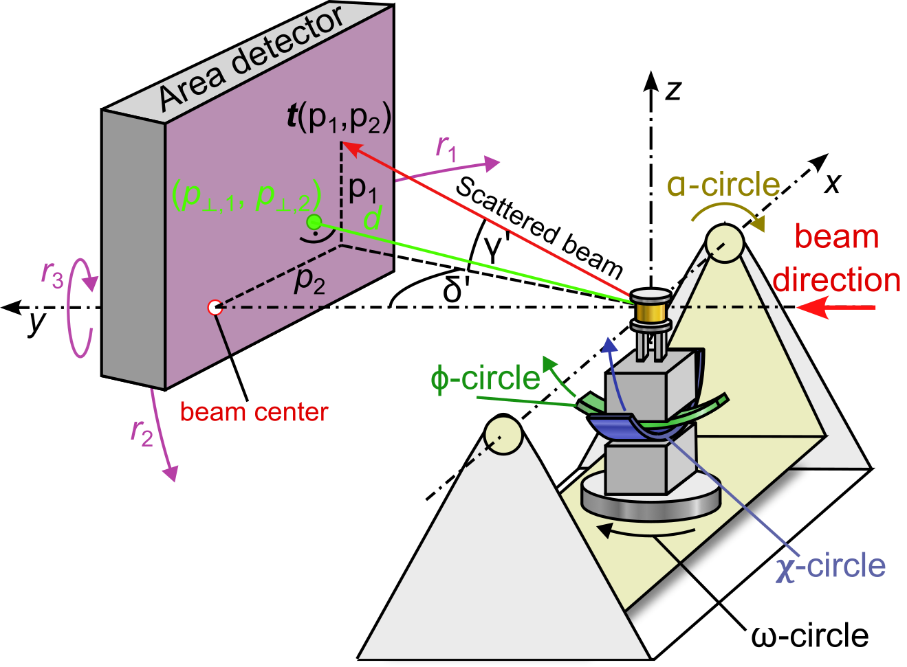

orGUI Geometry
==============

orGUI was developed for high-energy surface X-ray diffraction (HESXRD) and
transmission surface diffraction workflows where a large, stationary 2D detector
records many reciprocal-space features during a sample rotation. The geometry
combines a pyFAI-style detector description with a surface-diffraction
diffractometer convention based on Busing and Levy and on Lohmeier and Vlieg.

Reference Frames
----------------

The diffractometer origin is the sample position. In the laboratory frame,
``y`` points along the incident beam, ``x`` points perpendicular to the beam in
the radial direction, and ``z`` completes the right-handed frame. The azimuth
parameter in the machine settings rotates the diffractometer frame around the
incident beam direction; for an azimuth of 90 degrees, ``z`` points upward.

The sample is positioned by the ``alpha``, ``omega``, ``chi``, and ``phi``
circles. orGUI follows the Lohmeier and Vlieg angle convention for the shared
axes, but uses a ``phi`` circle around the ``x`` axis. The theta scan axis used
at some beamlines is mapped to the internal omega angle as
:math:`\theta = -\omega`.

Detector Geometry
-----------------

The detector model follows the pyFAI geometry convention. A detector pixel is
described relative to the point of normal incidence, the sample-detector
distance, and the detector rotations. The detector calibration therefore
provides the mapping between detector pixel coordinates and the scattering
angles observed by the area detector.

For surface diffraction, orGUI converts the detector scattering direction into
the in-plane and out-of-plane detector angles ``delta`` and ``gamma``. The
conversion accounts for the azimuthal reference direction of the surface normal
and for the current ``alpha`` setting. These angles are then used together with
the sample-circle angles in the reciprocal-space calculation.

Diffraction Equation
--------------------

The reciprocal lattice vector is written in reciprocal lattice coordinates as
:math:`\vec{H} = (h, k, l)^T`. The crystal ``B`` matrix converts this vector
from reciprocal lattice units to a Cartesian reciprocal-space vector, and the
orientation matrix ``U`` attaches the crystal to the inner sample-circle frame.

In orGUI notation, the sample rotations transform the crystal vector into the
``alpha`` frame. The momentum transfer vector is calculated from the incoming
and outgoing wavevectors in the same frame. The diffraction condition is met
when the transformed reciprocal lattice vector equals the measured momentum
transfer vector.

For crystal truncation rod and arbitrary line integration, the reciprocal-space
trajectory is described as

.. math::

   \vec{H}(s) = \vec{H}_0 + s\vec{H}_1

where :math:`\vec{H}_0` and :math:`\vec{H}_1` are vectors in reciprocal lattice
units. orGUI calculates the intersections of this line with the Ewald sphere and
converts the corresponding detector angles back to detector pixel coordinates.

Momentum Transfer and the Q-Plot
--------------------------------

The central plot of orGUI normally shows the detector image in **pixel
coordinates**; the reciprocal-space position of a pixel is reported in
reciprocal lattice units as the cursor is moved. The ``Q-plot`` toolbar action
switches the display to **momentum transfer**, the representation commonly used
for grazing-incidence work. This is a change of the displayed coordinates only,
it does not alter the loaded data.

Momentum transfer is split into a component parallel to the surface and one
along the surface normal,

* :math:`q_\parallel` -- in-plane momentum transfer, labelled ``qip`` and
  plotted as ``q_par``,
* :math:`q_\perp` -- out-of-plane momentum transfer, labelled ``qoop`` and
  plotted as ``q_perp``.

orGUI can calculate these two quantities in two different ways. Both describe
the same reciprocal space, but they differ in what they return and in when they
are used.

Per pixel with ``QAlpha``
~~~~~~~~~~~~~~~~~~~~~~~~~

This is the route used everywhere else in orGUI, for example for reflection
positions and for the rod integration. The detector calibration converts pixel
coordinates into the surface angles ``gamma`` and ``delta``, and the Vlieg
diffraction equation converts those angles into a Cartesian momentum transfer
vector in the ``alpha`` frame,

.. math::

   \begin{aligned}
   Q_x &= K \sin(\delta)\cos(\gamma) \\
   Q_y &= K \left[\cos(\delta)\cos(\gamma) - \cos(\alpha)\right] \\
   Q_z &= K \left[\sin(\gamma) + \sin(\alpha)\right]
   \end{aligned}

with :math:`K = 2\pi/\lambda`. The out-of-plane component is :math:`Q_z`, and
the in-plane component is the radial component in the surface plane:

.. code-block:: python

   import numpy as np

   detectorCal = ubcalc.detectorCal   # DetectorCalibration.Detector2D_SXRD
   angles = ubcalc.angles             # HKLVlieg.VliegAngles
   alpha_i = ubcalc.mu                # incidence angle in rad

   gamma, delta = detectorCal.surfaceAngles(alpha_i, shape=image.shape)
   Qxyz = angles.QAlpha(alpha_i, delta, gamma)   # inverse Angstrom

   q_perp = Qxyz[..., 2]                          # out-of-plane
   q_par = np.hypot(Qxyz[..., 0], Qxyz[..., 1])   # in-plane, unsigned

The result has the same shape as the detector image: every pixel keeps its own
momentum transfer. The sampling is therefore irregular and curved in
:math:`(q_\parallel, q_\perp)`, which is exactly what is needed to look up
where a reflection falls, but it cannot be handed to an image widget directly.

On a regular grid with ``FiberIntegrator``
~~~~~~~~~~~~~~~~~~~~~~~~~~~~~~~~~~~~~~~~~~

This is the route used by the ``Q-plot`` action. pyFAI's ``FiberIntegrator``
computes the same per-pixel momentum transfer and additionally **rebins** the
intensities onto a regular grid, which is what makes the result displayable as
an image:

.. code-block:: python

   from pyFAI.integrator.fiber import FiberIntegrator

   fi = FiberIntegrator(
       dist=detectorCal.dist,
       poni1=detectorCal.poni1,
       poni2=detectorCal.poni2,
       wavelength=detectorCal.wavelength,
       rot1=detectorCal.rot1,
       rot2=detectorCal.rot2,
       rot3=detectorCal.rot3,
       detector=detectorCal.detector,
   )
   res = fi.integrate2d_grazing_incidence(
       image,
       sample_orientation=4,      # depends on the azimuthal reference, see below
       incident_angle=alpha_i,
       tilt_angle=0,
       unit_ip="qip_A^-1",
       unit_oop="qoop_A^-1",
   )

   res.intensity     # rebinned image, shape (npt_oop, npt_ip)
   res.inplane       # q_par axis
   res.outofplane    # q_perp axis

``FiberIntegrator`` was introduced in pyFAI 2025.1. With an older pyFAI the
``Q-plot`` action is unavailable and reports an error instead.

Which one to use
~~~~~~~~~~~~~~~~

.. list-table::
   :header-rows: 1
   :widths: 22 39 39

   * -
     - ``QAlpha``
     - ``FiberIntegrator``
   * - Returns
     - one :math:`(q_\parallel, q_\perp)` per pixel
     - intensities rebinned onto a regular grid
   * - Sampling
     - irregular, curved
     - regular, uniform
   * - In-plane sign
     - unsigned, :math:`q_\parallel \ge 0`
     - signed
   * - Requires
     - nothing beyond orGUI
     - pyFAI >= 2025.1
   * - Use for
     - reflection positions, integration, any calculation
     - displaying a whole image in reciprocal space

Use ``QAlpha`` whenever the momentum transfer of a specific pixel or reflection
is needed. Use ``FiberIntegrator`` when a complete image has to be shown or
exported in reciprocal-space coordinates, and accept that the rebinning
quantises positions to the width of one grid cell.

Sample orientation and sign conventions
~~~~~~~~~~~~~~~~~~~~~~~~~~~~~~~~~~~~~~~

The two routes place the surface normal on the detector differently. orGUI
derives it from the azimuthal reference of the detector calibration, while
pyFAI expects the EXIF-style ``sample_orientation`` argument. The ``Q-plot``
action maps one onto the other:

.. list-table::
   :header-rows: 1
   :widths: 34 33 33

   * - Azimuthal reference
     - ``sample_orientation``
     - Flipped plot axis
   * - 0 degrees
     - 7
     - none
   * - 90 degrees (default)
     - 4
     - vertical
   * - 180 degrees
     - 8
     - horizontal
   * - 270 degrees
     - 1
     - none

pyFAI pairs each orientation with an in-plane mirrored partner -- (6, 7),
(3, 4), (5, 8) and (1, 2). Partners return an identical :math:`q_\perp` and
differ only in the **sign** of :math:`q_\parallel`. Because ``QAlpha`` returns
the unsigned radial in-plane component, both members of a pair are equally
correct for it; the sign is a display convention, which is why the ``Q-plot``
action flips a plot axis for some orientations.

With that convention fixed, the two routes agree to numerical precision. This
is verified in ``orgui/datautils/xrayutils/test/test_q_conversion.py``, which
compares them per pixel for flat and tilted detectors at several incidence
angles, and additionally checks that a single bright pixel is placed by
``integrate2d_grazing_incidence`` within one grid cell of the position
predicted by ``QAlpha``.

Further Reading
---------------

The implemented geometry is summarized in chapter 5, especially section 5.3, of
Timo Fuchs' dissertation. The angle convention builds on:

* W. R. Busing and H. A. Levy, Acta Crystallographica 22, 457-464 (1967).
* M. Lohmeier and E. Vlieg, Journal of Applied Crystallography 26, 706-716
  (1993), https://doi.org/10.1107/S0021889893004868.
