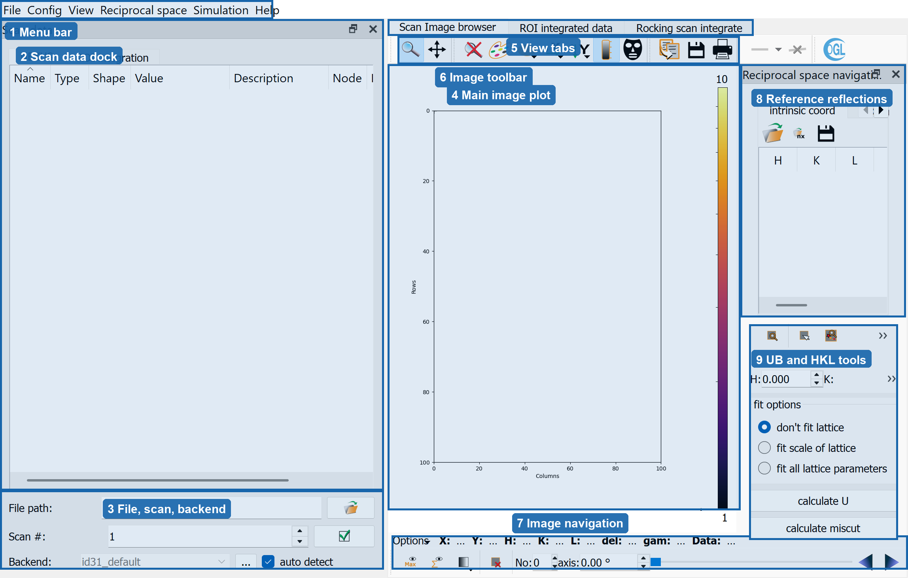

GUI Overview
============

The normal graphical user interface (GUI) is organized around three main
tasks: loading scans, inspecting detector images, and connecting image features
to reciprocal-space coordinates for orientation and integration.

The screenshot below shows the default layout after starting orGUI with
``examples/config_minimal``. The numbered regions are the main visible working
areas.

1. Menu Bar
-----------

The menu bar provides access to application-level actions:

``File``
   Open, refresh, and close Nexus/SPEC/log files; generate a scan from image
   files; load interlaced or segmented scans; and reload image data.

``Config``
   Load machine and crystal configuration, open machine/crystal parameter
   dialogs, adjust CPU count and database compression, control automatic scan
   loading, select background images, and edit excluded images.

``View``
   Toggle reference reflections, allowed Bragg reflections, ROI display, CTR
   reflections, and machine-parameter markers on the image plot.

``Reciprocal space``
   Calculate available CTRs and open the orientation-matrix editor.

``Simulation``
   Create a dummy scan for testing or demonstration.

``Help``
   Open geometry and application information dialogs.

2. Scan Data Dock
-----------------

The ``Scan data`` dock is the main scan-selection panel. Its ``NEXUS`` tab
shows the loaded file tree through a Nexus/HDF5 browser. Double clicking a
compatible scan node opens that scan.

The same dock also contains the ``ROI integration`` tab. That tab is not shown
in the screenshot, but it is where ROI size, background ROI size, integration
mode, correction options, and the ``ROI integrate scan`` action are configured.
The available integration modes are:

* ``hklscan``: stationary integration along ``H(s) = H_1 * s + H_0`` in r.l.u.
* ``fixed``: integration at a fixed detector-pixel ROI.
* ``rocking hklscan``: rocking-scan integration along an HKL line.
* ``rocking Bragg``: rocking-scan integration at calculated Bragg reflections.

3. File, Scan, And Backend Controls
-----------------------------------

These controls select the data source and loader:

``File path``
   Path to a Nexus, SPEC, or log file.

``Scan #``
   Scan number to load from the selected file. The button beside it opens the
   scan.

``Backend``
   Beamline/file-format loader used to interpret the selected scan. With
   ``auto detect`` enabled, orGUI tries to infer the backend from the selected
   Nexus metadata. The ``...`` button loads a custom backend file.

4. Main Image Plot
------------------

The ``Scan Image browser`` tab contains the central detector image plot. This
area displays the current detector frame and overlays such as reference
reflection markers, calculated Bragg/CTR reflections, machine-parameter
markers, masks, and ROIs.

The plot coordinates are detector pixels. When a scan and calibration are
available, orGUI also uses the image position and scan axis value to connect
pixels to reciprocal-space coordinates.

5. View Tabs
------------

The central workspace has three tabs:

``Scan Image browser``
   Inspect raw detector images and overlays.

``ROI integrated data``
   Plot integrated intensity curves and inspect integrated output data.

``Rocking scan integrate``
   Work with the rocking-peak integration helper.

6. Image Toolbar
----------------

The toolbar above the image plot contains common plot and image tools from the
plot widget, including zoom/pan-style navigation, colormap and display controls,
mask tools, and save/print-style actions. These tools operate on the image plot
currently shown in the ``Scan Image browser`` tab.

7. Image Navigation
-------------------

The lower image toolbar controls the active frame and scan overlays:

``Max`` / ``sum``
   Toggle display of the maximum image or summed image over the scan.

Transparency
   Adjust the alpha value of the max/sum overlay.

Exclude image
   Exclude the current image from max/sum image calculations.

``No``
   Current image number.

``axis``
   Current scan-axis value in degrees.

Slider and previous/next buttons
   Move through images in the loaded scan.

8. Reference Reflections
------------------------

The ``Reciprocal space navigation`` dock stores reference reflections used for
orientation-matrix calculation and navigation. The visible ``intrinsic coord``
table stores ``H``, ``K``, ``L``, detector ``x``/``y`` position, and image
number. The neighboring ``SIXC angles`` tab shows calculated diffractometer
angles for the selected reflections.

Useful actions in this area include:

* jump to the image associated with a selected reflection
* set the current image for a selected reflection
* perform a 2D peak search around a reflection
* add a suggested Bragg reflection when calculated candidates are available

Double clicking in the image plot can add or move reflection markers, depending
on the active interaction mode.

9. UB And HKL Tools
-------------------

The lower part of the ``Reciprocal space navigation`` dock contains the
orientation and HKL tools. The visible HKL spin boxes and search action calculate
where a requested reflection should appear. The fit options control how much
the lattice is adjusted when calculating the orientation matrix:

``don't fit lattice``
   Keep lattice parameters fixed and fit orientation from the selected
   reflections.

``fit scale of lattice``
   Fit a lattice scale factor when enough reflections are available.

``fit all lattice parameters``
   Fit all lattice parameters when enough reflections are available.

``calculate U``
   Calculate the orientation matrix from the current reference reflections.

``calculate miscut``
   Estimate the miscut from the deviation between the current orientation matrix
   and the ideal orientation.

Typical First Workflow
----------------------

1. Load a configuration from ``Config -> Load config`` or start orGUI with a
   config file.
2. Select the scan file, scan number, and backend in the ``Scan data`` dock.
3. Open a scan and inspect the detector image in ``Scan Image browser``.
4. Add or edit reference reflections in ``Reciprocal space navigation``.
5. Click ``calculate U`` and verify that calculated reflections match observed
   image features.
6. Switch to ``ROI integration`` in the ``Scan data`` dock, set ROI parameters,
   and integrate the desired scan.
